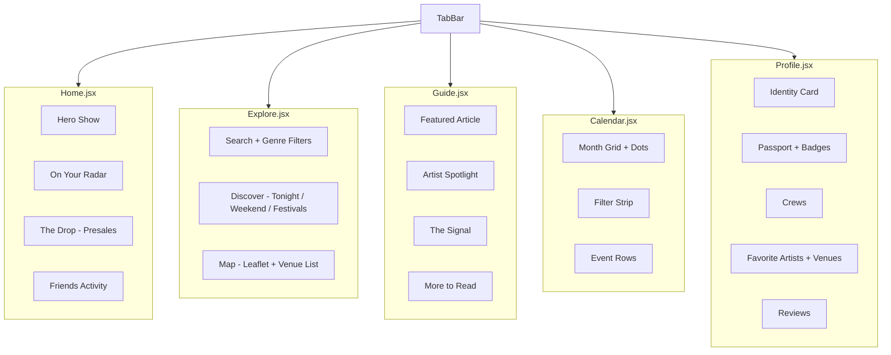
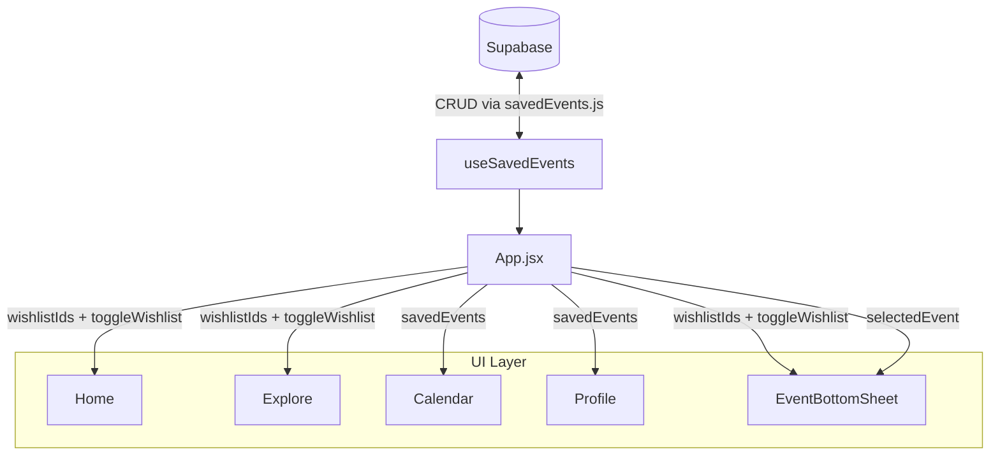

# Venu — Architecture & UI Map

**To render diagrams:** Install these two VSCode extensions:
- `Markdown Preview Mermaid Support` — renders diagrams in `Cmd+Shift+V` preview
- `Mermaid Editor` (by tomoyukim) — opens each diagram in a zoomable/pannable panel

---

## 1. Full Stack — Data to Screen

Data travels left → right: external APIs → lib → hooks → App.jsx → UI.

---

## 2. Tab-by-Tab UI Map

The `TabBar` switches between 5 page files. Each page is fully self-contained.

---

## 3. Shared Components — Usage by Page

| Component | File | Home | Explore | Guide | Calendar | Profile |
|---|---|:---:|:---:|:---:|:---:|:---:|
| `Chip` | components/index.jsx | ✓ | ✓ | ✓ | | |
| `WishlistButton` | components/index.jsx | ✓ | | | ✓ | |
| `MatchScore` | components/index.jsx | ✓ | ✓ | | | |
| `HScroll` | components/index.jsx | ✓ | ✓ | ✓ | | ✓ |
| `UserAvatar` | components/index.jsx | | | | | ✓ |
| `NotifBell` | components/index.jsx | ✓ | | | | |
| `CountdownBadge` | components/index.jsx | ✓ | | | | |
| `TicketStub` | components/marks/ | ✓ | | | | |
| `LiveBadge` | components/marks/ | ✓ | | ✓ | | |
| `Kicker` | components/marks/ | | | ✓ | | |
| `EditorialHeadline` | components/marks/ | ✓ | | ✓ | | |
| `Stamp` | components/marks/ | | | | | ✓ |
| `FlipDigits` | components/marks/ | ✓ | | | | |
| `EventBottomSheet` | components/ | ← rendered by App.jsx, opens over any tab | | | | |
| `NotificationsPanel` | components/ | ← rendered by App.jsx, slides in from right | | | | |
| `VenuMap` | components/ | | ✓ | | | |

---

## 4. Saved-Event State Flow

How wishlist/going data moves from Supabase to every interactive element.
`Home` and `Explore` also send events back up to `App` via `onEventSelect` to open the bottom sheet.

---

---

# UI Screenshot Index

A visual reference for every major screen and overlay. All screenshots taken from the live dev server at `localhost:5173`.

---

### Home Tab — `src/pages/Home.jsx`

**Top** — Hero show with tonight pill, Get Tickets CTA, On Your Radar match cards

**Scrolled** — The Drop presale tickets (HScroll of TicketStubs) + Friends activity feed

---

### Explore Tab — `src/pages/Explore.jsx`

Underline search, Genre Chip filters, Discover view (promoted card → Tonight → Weekend → Festivals)

---

### Guide Tab — `src/pages/Guide.jsx`

Featured article, Artist Spotlight (ink background), The Signal live updates, More to Read cards

---

### Calendar Tab — `src/pages/Calendar.jsx`

Month grid with wishlist/going/past dots, filter strip, event rows with amber left stripe

---

### Profile Tab — `src/pages/Profile.jsx`

Identity card (square avatar, handle, bio), stats strip, Passport badges

---

### EventBottomSheet — `src/components/EventBottomSheet.jsx`

Slides up over any tab when an event is selected. Shows artist, venue, date, lineup, and Get Tickets CTA. Wired to `useSavedEvents` for the wishlist toggle.

---

### NotificationsPanel — `src/components/NotificationsPanel.jsx`

Slides in from the right when the bell icon is tapped. Rendered by `App.jsx` so it floats above all tabs.

