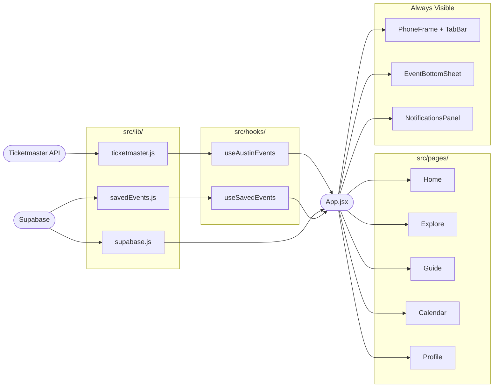
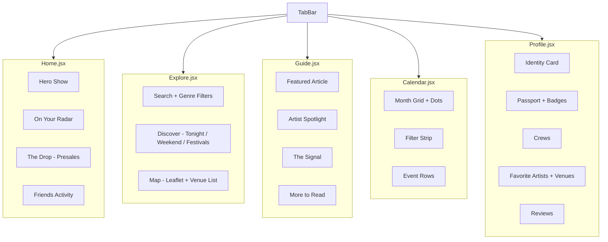
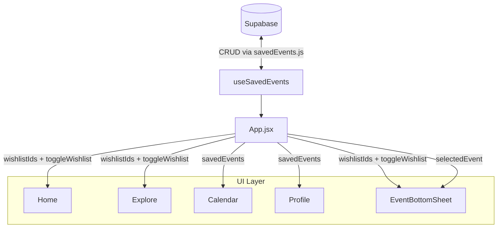
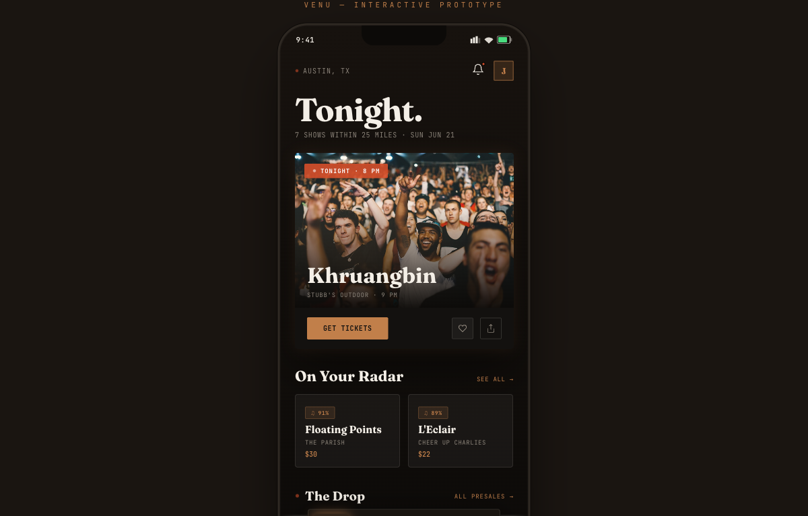
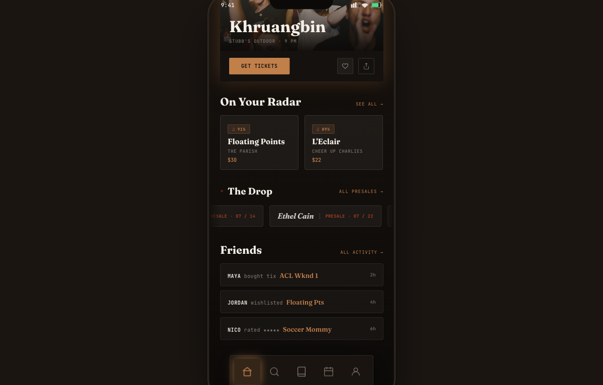
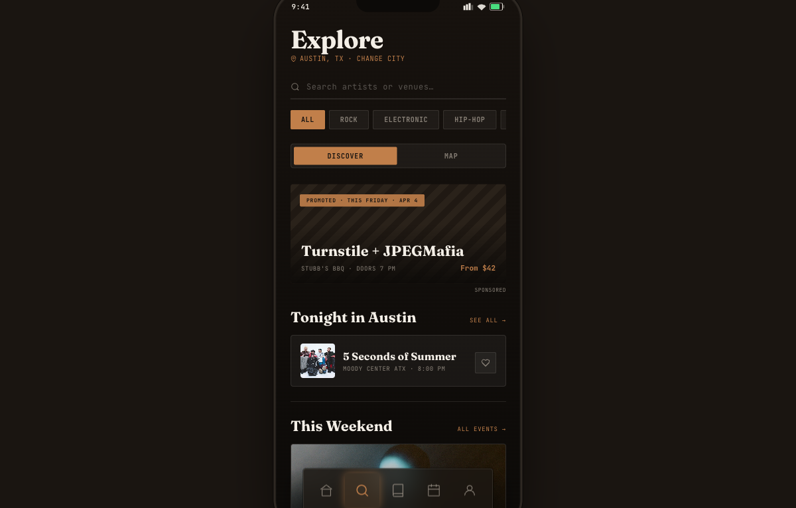
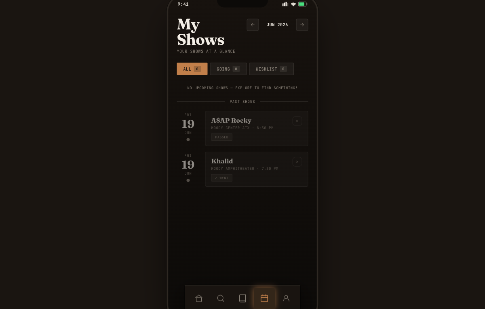
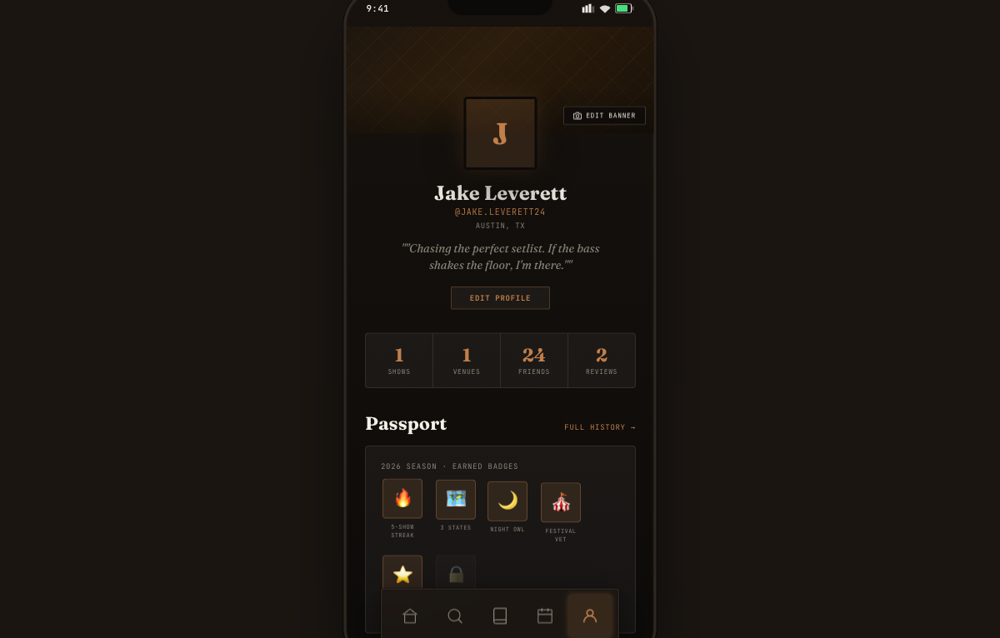
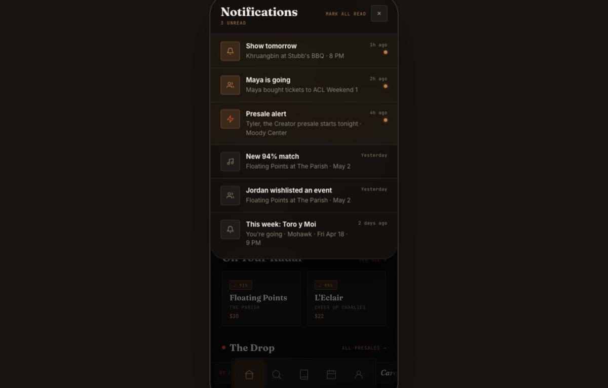

# Venu — Architecture & UI Map

**To render diagrams:** Install these two VSCode extensions:
- `Markdown Preview Mermaid Support` — renders diagrams in `Cmd+Shift+V` preview
- `Mermaid Editor` (by tomoyukim) — opens each diagram in a zoomable/pannable panel

**To refresh screenshots:** Run `/update-architecture-docs` — Claude will retake all screenshots and commit them.

---

## 1. Full Stack — Data to Screen

Data travels left → right: external APIs → lib → hooks → App.jsx → UI.



---

## 2. Tab-by-Tab UI Map

The `TabBar` switches between 5 page files. Each page is fully self-contained.



---

## 3. Shared Components — Usage by Page

| Component | File | Home | Explore | Guide | Calendar | Profile |
|---|---|:---:|:---:|:---:|:---:|:---:|
| `Chip` | components/index.jsx | ✓ | ✓ | ✓ | | |
| `WishlistButton` | components/index.jsx | ✓ | | | ✓ | |
| `MatchScore` | components/index.jsx | ✓ | ✓ | | | |
| `HScroll` | components/index.jsx | ✓ | ✓ | ✓ | | ✓ |
| `UserAvatar` | components/index.jsx | | | | | ✓ |
| `NotifBell` | components/index.jsx | ✓ | | | | |
| `CountdownBadge` | components/index.jsx | ✓ | | | | |
| `TicketStub` | components/marks/ | ✓ | | | | |
| `LiveBadge` | components/marks/ | ✓ | | ✓ | | |
| `Kicker` | components/marks/ | | | ✓ | | |
| `EditorialHeadline` | components/marks/ | ✓ | | ✓ | | |
| `Stamp` | components/marks/ | | | | | ✓ |
| `FlipDigits` | components/marks/ | ✓ | | | | |
| `EventBottomSheet` | components/ | ← rendered by App.jsx, opens over any tab | | | | |
| `NotificationsPanel` | components/ | ← rendered by App.jsx, slides in from right | | | | |
| `VenuMap` | components/ | | ✓ | | | |

---

## 4. Saved-Event State Flow

How wishlist/going data moves from Supabase to every interactive element.
`Home` and `Explore` also send events back up to `App` via `onSelectEvent` to open the bottom sheet.



---

---

# UI Screenshot Index

A visual reference for every major screen and overlay. Each section includes:
- a screenshot of the live UI
- the key code that produces what you see

---

### Home Tab — `src/pages/Home.jsx`

**Top** — Hero show with tonight pill, Get Tickets CTA, On Your Radar match cards



**How the data gets here.** `App.jsx` is the hub. It calls `useSavedEvents()` once, then passes the results down to every page as props:

```jsx
// src/App.jsx — the hub that wires everything together
const { savedEvents, wishlistIds, toggleWishlist } = useSavedEvents();

<ActivePage
  savedEvents={savedEvents}      // full list from Supabase
  wishlistIds={wishlistIds}      // Set of IDs the user has wishlisted
  toggleWishlist={toggleWishlist} // function to add/remove from wishlist
  onSelectEvent={setSelectedEvent} // tells App to open the bottom sheet
/>
```

**How the WishlistButton knows if it's active.** The heart icon on the hero card checks whether the event's ID is in the `wishlistIds` Set:

```jsx
// src/pages/Home.jsx
<WishlistButton
  active={wishlistIds.has(heroShow?.id)}  // filled = true, outline = false
  onClick={() => toggleWishlist(heroShow)}
/>
```

```jsx
// src/components/index.jsx — WishlistButton renders differently based on `active`
export const WishlistButton = ({ active, onClick }) => (
  <button onClick={onClick}>
    <svg fill={active ? "#C17F4A" : "none"}   // amber fill when wishlisted
         stroke={active ? "#C17F4A" : "#8A8278"}>
      <path d="M20.84 4.61a5.5 5.5 0 00-7.78 0L12 5.67..." />
    </svg>
  </button>
);
```

**Scrolled** — The Drop presale tickets (HScroll of TicketStubs) + Friends activity feed



**How the horizontal scroll works.** `HScroll` is just a flex container with `overflowX: auto`. You drop any children inside it:

```jsx
// src/components/index.jsx
export const HScroll = ({ children, gap = 12 }) => (
  <div style={{ display: "flex", overflowX: "auto", gap, scrollbarWidth: "none" }}>
    {children}  {/* each child becomes one card in the horizontal strip */}
  </div>
);
```

---

### Explore Tab — `src/pages/Explore.jsx`

Underline search, Genre Chip filters, Discover view (promoted card → Tonight → Weekend → Festivals)



**How the Discover / Map toggle works.** This is local state — it only lives inside `Explore.jsx` and doesn't need to go up to `App`:

```jsx
// src/pages/Explore.jsx
const [mode, setMode] = useState("discover"); // "discover" | "map"

// The two toggle buttons
<button onClick={() => setMode("discover")}>Discover</button>
<button onClick={() => setMode("map")}>Map</button>

// Conditionally render one view or the other
{mode === "discover" ? <DiscoverView /> : <VenuMap />}
```

**How the Chip filter highlights.** The active genre is also local state. When a Chip is clicked, it updates `activeGenre`, which re-renders the list with filtered results:

```jsx
const [activeGenre, setActiveGenre] = useState("All");

// Chip turns amber when its label matches the active genre
<Chip
  label="Electronic"
  active={activeGenre === "Electronic"}
  onClick={() => setActiveGenre("Electronic")}
/>
```

---

### Guide Tab — `src/pages/Guide.jsx`

Featured article, Artist Spotlight (ink background), The Signal live updates, More to Read cards


**How the layout sections are structured.** Guide is mostly static — no Supabase calls. It renders a series of stacked sections, each using the same `Screen` + `SectionHeader` components:

```jsx
// src/pages/Guide.jsx — simplified structure
const Guide = () => (
  <Screen>
    <FeaturedArticle />       {/* big full-width card */}
    <SectionHeader title="Spotlight" />
    <SpotlightCard />         {/* dark ink background card */}
    <SectionHeader title="The Signal" link="See All →" />
    <SignalItems />           {/* list of live-update rows */}
    <SectionHeader title="More to Read" />
    <ArticleCards />          {/* smaller cards in a scroll */}
  </Screen>
);
```

---

### Calendar Tab — `src/pages/Calendar.jsx`

Month grid with wishlist/going/past dots, filter strip, event rows with amber left stripe



**How the dots on calendar days work.** `savedEvents` comes in as a prop from `App`. The calendar loops over it to know which days have events, then renders a colored dot per status:

```jsx
// src/pages/Calendar.jsx
const Calendar = ({ savedEvents }) => {
  const [selectedDate, setSelectedDate] = useState(today);

  // Find which dates have saved events
  const eventsByDate = savedEvents.reduce((acc, e) => {
    acc[e.date] = [...(acc[e.date] || []), e];
    return acc;
  }, {});

  // Day cell shows a dot if that date has events
  const dayHasEvent = eventsByDate[day] != null;
};
```

**The filter strip** (All / Going / Wishlist) is also local `useState` — same pattern as Explore's genre filter.

---

### Profile Tab — `src/pages/Profile.jsx`

Identity card (square avatar, handle, bio), stats strip, Passport badges



**How the profile name is derived from the auth session.** There's no separate "display name" field — it's extracted from the logged-in email:

```jsx
// src/pages/Profile.jsx
const Profile = ({ session }) => {
  // session.user.email = "jake@example.com" → displayName = "jake"
  const displayName = session?.user?.email?.split("@")[0] ?? "you";

  return <div>{displayName}</div>;
};
```

**The `session` object** comes from Supabase auth and is managed in `App.jsx`:

```jsx
// src/App.jsx
const [session, setSession] = React.useState(null);

React.useEffect(() => {
  supabase.auth.getSession().then(({ data: { session } }) => {
    setSession(session);  // sets it once on load
  });

  // then keeps it in sync when user logs in/out
  supabase.auth.onAuthStateChange((event, session) => {
    setSession(session);
  });
}, []); // [] = run this once when App mounts
```

---

### EventBottomSheet — `src/components/EventBottomSheet.jsx`

Slides up over any tab when an event is selected. Shows artist, venue, date, lineup, and Get Tickets CTA. Wired to `useSavedEvents` for the wishlist toggle.


**How it opens.** Any page can call `onSelectEvent(eventObject)` — that's a prop passed from `App`. App stores it in `selectedEvent` state, then passes it to `EventBottomSheet`:

```jsx
// src/App.jsx
const [selectedEvent, setSelectedEvent] = React.useState(null);

// Passed to every page:
<ActivePage onSelectEvent={setSelectedEvent} />

// EventBottomSheet is always rendered — it just hides when event is null
<EventBottomSheet
  event={selectedEvent}          // null = hidden, object = visible
  onClose={() => setSelectedEvent(null)}
  wishlistIds={wishlistIds}
  toggleWishlist={toggleWishlist}
/>
```

**The slide animation** is pure CSS — no animation library. The sheet translates off-screen when `event` is null:

```jsx
// src/components/EventBottomSheet.jsx
<div style={{
  transform: event ? "translateY(0)" : "translateY(110%)",
  transition: "transform 0.35s cubic-bezier(0.32,0,0.67,0)",
}}>
```

---

### NotificationsPanel — `src/components/NotificationsPanel.jsx`

Slides in from the right when the bell icon is tapped. Rendered by `App.jsx` so it floats above all tabs.



**How unread state is managed.** The notifications list lives in local `useState` inside this component. Clicking a row marks it read by mapping over the array and flipping one item's `unread` flag:

```jsx
// src/components/NotificationsPanel.jsx
const [notifs, setNotifs] = useState(initialNotifs); // loaded from static data

const unreadCount = notifs.filter(n => n.unread).length;

// Mark a single notification read — creates a new array (React requires this)
const markRead = (id) =>
  setNotifs(prev => prev.map(n => n.id === id ? { ...n, unread: false } : n));

// Mark all read at once
const markAllRead = () =>
  setNotifs(prev => prev.map(n => ({ ...n, unread: false })));
```

---

---

# React Primer — For Angular Developers

You know Angular well. Here's how React's concepts map to what you already know.

---

## Components are just functions

**Angular:** A class decorated with `@Component`, with a separate template file.

**React:** A plain function that returns JSX (HTML-like syntax). No decorator, no separate file.

```jsx
// React component — just a function
const MyCard = ({ title, subtitle }) => (
  <div style={{ padding: 16 }}>
    <h2>{title}</h2>
    <p>{subtitle}</p>
  </div>
);

// Used like HTML:  <MyCard title="Khruangbin" subtitle="Stubb's · 9 PM" />
```

The curly braces `{}` in JSX are the equivalent of `{{ }}` in Angular templates — they evaluate a JavaScript expression.

---

## Props = `@Input()`

**Angular:**
```typescript
@Input() title: string;
@Input() active: boolean;
```

**React:** Props are just the function's first argument, destructured:
```jsx
const Chip = ({ label, active, onClick }) => ( ... );
//             ^^^^^^^^^^^^^^^^^^^^^^^^^^^
//             everything the parent passes in
```

When you use the component, you pass props like HTML attributes:
```jsx
<Chip label="Electronic" active={true} onClick={() => setGenre("Electronic")} />
```

---

## `useState` = local reactive state

**Angular:** Component properties tracked automatically by change detection.

**React:** You declare state explicitly with `useState`. It returns the value and a setter — you **must** call the setter to trigger a re-render:

```jsx
// Declare state
const [activeGenre, setActiveGenre] = useState("All");
//     ^^^^^^^^^^^  ^^^^^^^^^^^^^^   ^^^^^^^^^^^^^^^^^
//     current val  function to      initial value
//                  change it

// Read it in JSX
<span>{activeGenre}</span>

// Change it (triggers re-render)
<button onClick={() => setActiveGenre("Electronic")}>Electronic</button>
```

> Angular's two-way binding (`[(ngModel)]`) is two things in React: the `value` prop (read) + an `onChange` handler (write). You wire them manually.

---

## `useEffect` = `ngOnInit` + `ngOnDestroy`

**Angular:**
```typescript
ngOnInit() { this.load(); }
ngOnDestroy() { this.subscription.unsubscribe(); }
```

**React:** One hook handles both. The function body runs on mount; the returned function runs on unmount:

```jsx
// src/App.jsx — loads the Supabase auth session once when App mounts
React.useEffect(() => {
  // === ngOnInit ===
  supabase.auth.getSession().then(({ data: { session } }) => {
    setSession(session);
  });

  const { data: { subscription } } = supabase.auth.onAuthStateChange((_, session) => {
    setSession(session);
  });

  // === ngOnDestroy ===  (the return value is the cleanup function)
  return () => subscription.unsubscribe();

}, []); // ← the dependency array. [] = run once on mount, like ngOnInit
```

**The dependency array** controls when the effect re-runs:
- `[]` — run once on mount only
- `[userId]` — re-run whenever `userId` changes
- no array — run after every render (rarely what you want)

---

## Custom hooks = Angular Services (but per-component, not singleton)

**Angular:** You inject a `@Injectable()` service that's a singleton — one instance shared across the app.

**React:** A custom hook is a function that encapsulates `useState` + `useEffect`. Each component that calls it gets its **own** instance:

```jsx
// src/hooks/useSavedEvents.js
export const useSavedEvents = () => {
  const [savedEvents, setSavedEvents] = useState([]);

  useEffect(() => {
    fetchSavedEvents().then(setSavedEvents); // fetch from Supabase on mount
  }, []);

  // Derive Sets from the raw list — no extra state needed
  const wishlistIds = new Set(
    savedEvents.filter(e => e.status !== "going").map(e => e.event_id)
  );

  const toggleWishlist = async (event) => { /* optimistic update + API call */ };

  return { savedEvents, wishlistIds, toggleWishlist };
};

// src/App.jsx — calls the hook, gets back the data and functions
const { savedEvents, wishlistIds, toggleWishlist } = useSavedEvents();
```

---

## "Props down, events up" = `@Input()` + `@Output()`

This is the core React data pattern. It maps directly to Angular:

| Angular | React |
|---|---|
| `@Input() event` | `event` prop |
| `@Output() onSelect = new EventEmitter()` | `onSelect` callback prop |
| `this.onSelect.emit(data)` | `onSelect(data)` |

In this codebase:

```jsx
// App.jsx passes a setter down as a callback prop
<ActivePage onSelectEvent={setSelectedEvent} />
//                         ^^^^^^^^^^^^^^^^
//                         this is a function, not an EventEmitter

// Home.jsx calls it when user taps an event card
const Home = ({ onSelectEvent }) => (
  <div onClick={() => onSelectEvent(show)}>
    ...
  </div>
);
// This causes App's `selectedEvent` state to update → EventBottomSheet opens
```

---

## JSX is not a template file — it's the return value

**Angular:** Logic in `.ts`, template in `.html`. They're linked via the decorator.

**React:** Logic and UI are in the same function. The `return` statement is where the "template" goes. JSX compiles to regular JavaScript function calls — there's no magic:

```jsx
// This JSX:
const el = <Chip label="Rock" active={true} />;

// Compiles to this plain JS:
const el = React.createElement(Chip, { label: "Rock", active: true });
```

That's why you need `import React from "react"` at the top of files — JSX needs it in scope.

---

## Rendering lists — `map()` instead of `*ngFor`

**Angular:** `*ngFor="let show of shows"`

**React:** `.map()` returns an array of JSX elements. React renders arrays automatically:

```jsx
// Each item needs a unique `key` prop — React uses it to track changes efficiently
// (like Angular's trackBy)
{shows.map(show => (
  <div key={show.id}>
    {show.artist} · {show.venue}
  </div>
))}
```

---

## Conditional rendering — `&&` and ternary instead of `*ngIf`

**Angular:** `*ngIf="isLoading"` / `*ngIf="user; else loginBlock"`

**React:** Plain JavaScript expressions inside `{}`:

```jsx
// Show only if loading (equivalent to *ngIf="isLoading")
{isLoading && <Spinner />}

// Show one or the other (equivalent to *ngIf="session; else auth")
{session ? <App /> : <Auth />}
```

You can see both patterns in `App.jsx`:
```jsx
{loading ? null : session ? <ActivePage ... /> : <Auth />}
//         ^^^^   ^^^^^^^     ^^^^^^^^^^^^^        ^^^^^^
//         blank  logged in   show the app         show login
```
