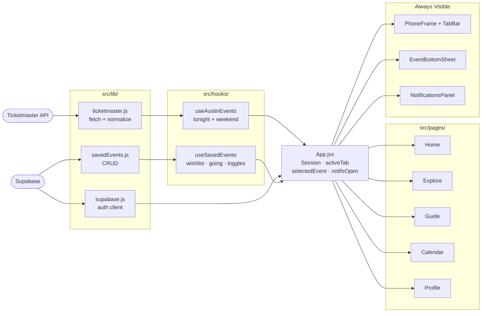
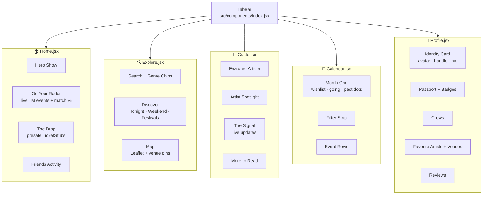
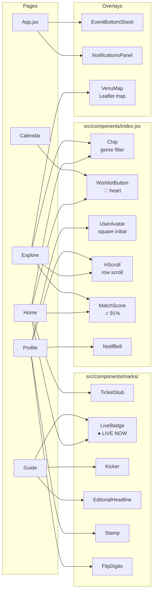
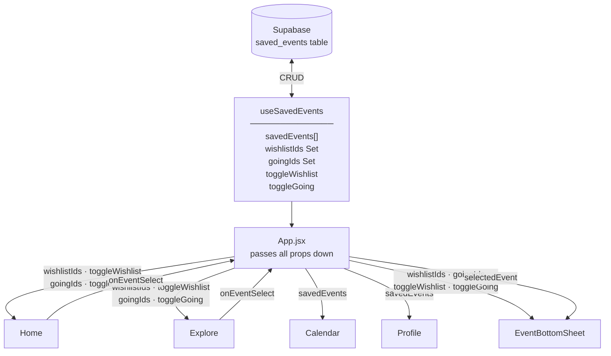

# Venu — Architecture & UI Map

**To render diagrams:** Install these two VSCode extensions:
- `Markdown Preview Mermaid Support` — renders diagrams in `Cmd+Shift+V` preview
- `Mermaid Editor` (by tomoyukim) — opens any diagram in a zoomable/pannable panel

Then press `Cmd+Shift+V` to open the preview.

---

## 1. Full Stack — Data to Screen

Data travels left → right: external APIs → lib → hooks → App → UI.

---

## 2. Tab-by-Tab UI Map

Each tab is a separate page file. The TabBar in `src/components/index.jsx` switches between them.

---

## 3. Shared Components

Which pages use which components from the shared component files.

---

## 4. Saved-Event State Flow

How wishlist/going state flows from Supabase down to every interactive element.

