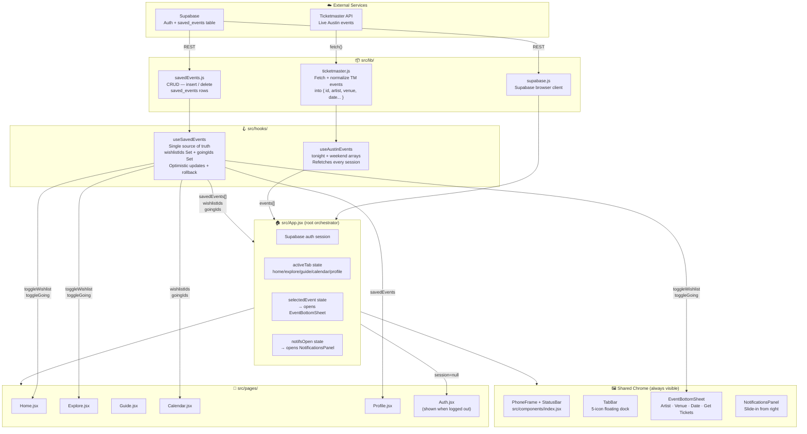
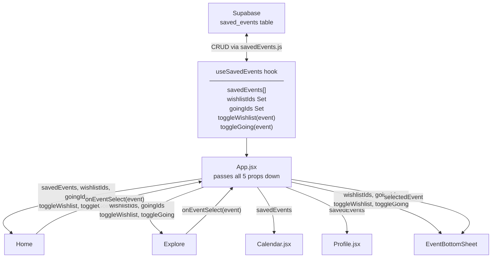

# Venu — Architecture & UI Map

Open this file in VSCode and press `Cmd+Shift+V` to render the diagrams.

---

## 1. Full Stack — Data to Screen

How data travels from external APIs all the way to what you see on screen.

---

## 2. Tab-by-Tab UI Map

What each tab shows and which file drives it.

```mermaid
flowchart LR
    subgraph TAB1["🏠 Home  —  Home.jsx"]
        H1["Hero Show\nArtist photo · Tonight pill\nGet Tickets button"]
        H2["On Your Radar\nMatch % cards\n(live from Ticketmaster)"]
        H3["The Drop\nPresale countdown tickets\nHScroll of TicketStubs"]
        H4["Friends Activity\nFriendRow bylines"]
    end

    subgraph TAB2["🔍 Explore  —  Explore.jsx"]
        E1["Underline search\n+ Genre Chip filters"]
        E2["Discover view\nPromoted → Tonight list\n→ Weekend → Festivals"]
        E3["Map view\nLeaflet map (CartoDB)\nVenue pins + list"]
    end

    subgraph TAB3["📖 Guide  —  Guide.jsx"]
        G1["Featured Article\nFull-bleed image card"]
        G2["Artist Spotlight\nInk background editorial"]
        G3["The Signal\nLive-updated short items"]
        G4["More to Read\nHScroll article cards"]
    end

    subgraph TAB4["📅 Calendar  —  Calendar.jsx"]
        C1["Month grid\nDots = wishlist / going / past"]
        C2["Filter strip\nAll · Going · Wishlist · Past"]
        C3["Event rows\nLeft amber stripe + date block"]
    end

    subgraph TAB5["👤 Profile  —  Profile.jsx"]
        P1["Identity card\nSquare avatar · Handle · Bio"]
        P2["Stats strip\nShows · Venues · Friends · Reviews"]
        P3["Passport\nBadges earned this season"]
        P4["Crews\nSquare avatar stacks · Polls · Playlist"]
        P5["Favorite Artists / Venues\nSquare image thumbnails"]
        P6["Reviews\nFraunces italic · Star rating · Edit/Delete"]
    end

    TAB1 --- TAB2 --- TAB3 --- TAB4 --- TAB5
```

---

## 3. Shared Components

Components used across multiple pages.

```mermaid
flowchart TD
    subgraph ATOMS["⚛️  src/components/index.jsx"]
        Chip["Chip\nGenre filter button\nActive = amber fill"]
        TagPill["TagPill\nRead-only genre tag"]
        MatchScore["MatchScore\n♫ 91% badge"]
        WB["WishlistButton\n♡ heart, wires to useSavedEvents"]
        UA["UserAvatar\nSquare initial block"]
        NB["NotifBell\nBell + unread dot"]
        HS["HScroll\nHidden-scrollbar row"]
        CB["CountdownBadge\nFlip-style days counter"]
    end

    subgraph MARKS["🎟️  src/components/marks/index.jsx"]
        Kicker["Kicker\nMono-caps label + dot"]
        EH["EditorialHeadline\nFraunces italic display type"]
        TS["TicketStub\nPerforated-edge ticket"]
        Stamp["Stamp\nSVG rubber stamp with ink filter"]
        LB["LiveBadge\n● LIVE NOW pulse"]
        FD["FlipDigits\nFlip-clock number display"]
        HR["HairlineRule\n1px divider + optional label"]
    end

    subgraph OVERLAY["🪟  Overlays (rendered in App.jsx)"]
        EBS["EventBottomSheet\nSlides up over any tab\nArtist · Lineup · Tickets"]
        NP["NotificationsPanel\nSlides in from right"]
    end

    subgraph MAP["🗺️  src/components/VenuMap.jsx"]
        VM["Leaflet map\nCartoDB Voyager tiles\nCustom amber pins"]
    end

    Home --> Chip & MatchScore & WB & TS & LB & EH
    Explore --> Chip & HS & VM & MatchScore
    Guide --> Kicker & EH & HR & LB
    Cal --> WB
    Profile --> UA & NB & HS & Stamp & FD

    App --> EBS & NP
```

---

## 4. State & Props Flow

How saved-event state flows from Supabase down to every interactive element.

