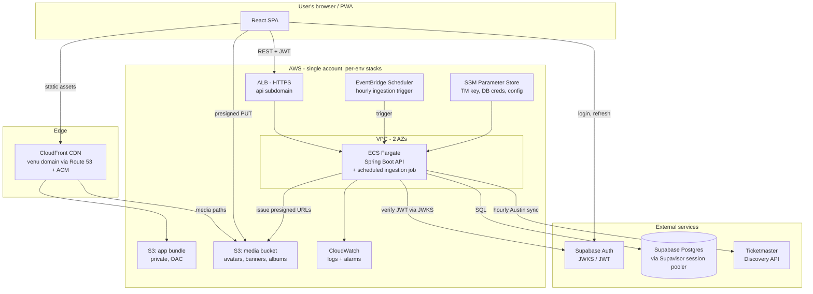
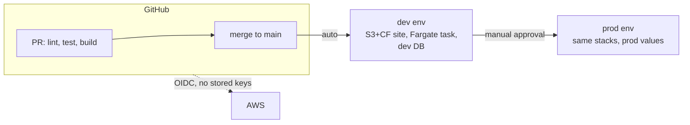
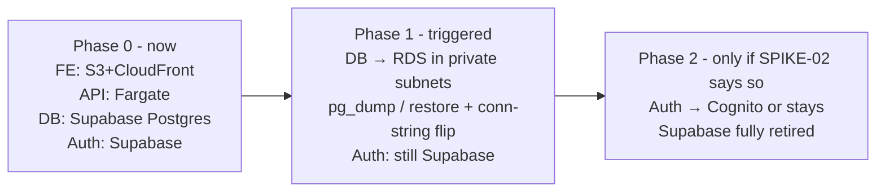

# SPIKE-01 — AWS Cloud Architecture (Research Draft)

**Jira:** [VENU-66](https://aeweinbach.atlassian.net/browse/VENU-66) · **Status:** Draft for team review — nothing here is decided until the team signs off
**Inputs:** `jira-stories/SPIKE-01` acceptance criteria, `INTENT.md`, the intent doc in `Venu-Feature-List.md`, SPIKE-02/03/04/05 briefs, INFRA-01..04 briefs, prototype source in `archived-src/`

> All prices are **approximate US-region on-demand rates** and drift over time. Before sign-off, plug the final shape into the [AWS Pricing Calculator](https://calculator.aws) — that exercise is worth doing as a team once.

---

## TL;DR — Recommended MVP shape

| Area | Recommendation | Rough monthly cost (prod + dev) |
|---|---|---|
| Frontend hosting | S3 (private) + CloudFront + Route 53 + ACM | ~$1–3 |
| Backend compute | ECS Fargate (1 task, ARM) behind an ALB | ~$35–45 |
| Database | **Keep Supabase Postgres through MVP**; RDS later (open question ⚠️) | $0–25 |
| Auth | Keep Supabase Auth; Spring validates JWTs (SPIKE-02's call) | $0 |
| Ticketmaster | Server-side scheduled ingestion into our DB (SPIKE-04's call) | ~$0 |
| Media | S3 + presigned uploads, served via CloudFront | ~$1 |
| Secrets | SSM Parameter Store (SecureString) | $0 |
| Environments | dev + prod, single AWS account, everything in IaC | — |
| **Total** | | **~$40–75/mo** (~$65–100 once RDS exists) |

The two decisions that most need *team discussion* rather than research: **when to move the database off Supabase**, and **whether MVP ships as web/PWA or native** (see Strategic question below — it's bigger than this spike but shapes it).

---

## 0. A strategic tension to settle first

The intent doc (`Venu-Feature-List.md` §6) explicitly **rejected "web-first launch"** — "concert discovery is a mobile, in-the-moment behavior; push notifications and camera (photos) are core to the loop." Yet all 35 UI stories build a React **web** app, and INFRA-01 hosts it on S3/CloudFront.

These can both be true (web/PWA now as the fastest path, native later), but the team should say so out loud, because it changes real things:

- **Push notifications** — Web Push doesn't reach iOS users unless they install the PWA to their home screen (SPIKE-05). If The Drop's "never miss a presale" promise is core, and our users are iPhone-heavy, this is a product risk to acknowledge now, not discover in Phase 2.
- **Camera/photos** — browser file-input upload works but is clunkier than a native camera flow (Your Shows photos are Phase 1 per the intent doc).

**Why this doesn't blow up SPIKE-01:** everything server-side — the Java API, database, event ingestion, media storage, auth — serves a native app exactly as well as a web app. The only piece that's web-specific is S3/CloudFront static hosting (~$2/mo). So the backend investment is safe either way; we just shouldn't over-invest in web-only plumbing (e.g., elaborate Web Push infra) before this is settled.

**Recommendation:** this question got its own deep-dive after this draft was written — see `docs/spikes/SPIKE-06-mobile-platform-strategy.md`, which recommends **React Native + Expo now** (superseding the earlier "PWA for MVP" lean). If the team adopts it, §2.1 below shrinks to a landing page + share-link site and the rest of this document stands unchanged.

---

## 1. Target architecture (MVP)

Request flow in words: the browser gets the app from CloudFront, logs in against Supabase Auth (as the prototype already does), then calls `https://api.<domain>` with the JWT. Spring validates the token, reads/writes Postgres, and returns JSON. Event data doesn't flow through the browser from Ticketmaster anymore — an hourly job pulls Austin events into our own `events` table, which fixes the **exposed API key** problem (`VITE_TICKETMASTER_API_KEY` currently ships in the JS bundle — anyone can read it in dev tools and burn our 5k/day quota).

---

## 2. Decision areas

### 2.1 Frontend hosting — S3 + CloudFront ✅ (baseline confirmed)

**Options considered:** S3+CloudFront vs Amplify Hosting.

Amplify Hosting bundles CI/CD, previews, and hosting into one console-clicky service — genuinely easier day 1. But INFRA-04 already commits to GitHub Actions, SPIKE-03 wants everything in IaC, and Amplify's abstractions get awkward the moment you step outside its happy path (custom CloudFront behaviors, the media distribution, response headers). S3+CloudFront is the pattern every AWS shop uses, it's ~$1–3/mo at our traffic (CloudFront's free tier covers ~1 TB/mo), and the skills transfer.

**Impact if we get this wrong:** low — either choice can be swapped in a weekend. This is a "pick one and stop thinking about it" decision.

Specifics for INFRA-01: private bucket with Origin Access Control (never public-website mode), SPA fallback (403/404 → `/index.html`), long-cache hashed assets + no-cache `index.html`, one distribution per environment.

### 2.2 Backend compute — ECS Fargate + ALB ✅ (with a cheaper alternative to consciously reject)

**Options considered:**

| | ECS Fargate + ALB | App Runner | Elastic Beanstalk | Lambda + SnapStart |
|---|---|---|---|---|
| Ops burden | Medium | **Lowest** | Medium, dated | Low |
| Fixed cost floor | ~$30/mo (ALB is ~$20 of it) | ~$10–15/mo | ~$10/mo | ~$0 idle |
| JVM fit | ✅ | ✅ | ✅ | ⚠️ SnapStart helps, still awkward |
| Scheduled jobs, WebSockets later | ✅ | ⚠️ limited | ✅ | ⚠️ |
| Industry-standard / hireable | ✅✅ | ✅ | ⚠️ | ✅ |

**Recommendation: ECS Fargate**, matching INFRA-02's baseline — 1 task (0.5 vCPU / 1 GB, ARM/Graviton — ~20 % cheaper than x86) in prod, 1 Fargate Spot task in dev. But do it with two cost-conscious choices juniors usually learn the expensive way:

1. **No NAT Gateway.** A NAT Gateway is ~$33/mo + data *before you run anything*. Instead, run Fargate tasks in **public subnets with public IPs**, locked down by security groups (only the ALB can reach the task port; the task can reach out to Ticketmaster/Supabase). Private-subnets-plus-NAT is the enterprise pattern; for a 3-person MVP it's paying $400/yr for ceremony. Document it as a deliberate, revisitable trade.
2. **ARM images.** Build the Docker image for `linux/arm64` from day one (Spring Boot doesn't care), ~20 % cheaper compute forever.

**The honest alternative:** App Runner would cut ~$25/mo (no ALB) and most of the VPC learning curve. We're recommending against it because ECS is what the INFRA stories assume, it grows into scheduled tasks/workers without re-platforming, and the team explicitly wants transferable AWS skills — but if the budget answer to §5 comes back "keep it under $30/mo," App Runner is the right answer and INFRA-02 should be re-pointed. That's a legitimate outcome of this spike, not a failure.

**Impact if we get this wrong:** medium — moving Fargate↔App Runner later is a re-plumbing week, not a rewrite (same container image either way).

### 2.3 Database — the real open question ⚠️

**Options:** (a) keep Supabase Postgres through MVP, (b) RDS PostgreSQL now, (c) Aurora Serverless v2.

**Aurora Serverless v2 is out** for MVP: its pricing floor (unless you rely on scale-to-zero, which adds ~15 s cold-resume — unacceptable behind an interactive API) lands well above a t4g RDS instance, and its scaling superpowers solve problems we won't have at single-city scale.

**The interesting fork is (a) vs (b):**

| | Keep Supabase Postgres (a) | RDS now (b) |
|---|---|---|
| Cost now | $0 (free tier) – $25 (Pro) | ~$14/mo prod (db.t4g.micro + 20 GB) |
| Migration work now | none | small — `saved_events` export/import; users provision on first login (API-04) so no user-table migration |
| Migration work later | one planned cutover: `pg_dump`/restore + connection-string flip | none |
| Network | API crosses the internet to Supabase (fine if same AWS region; ~1–5 ms) | in-VPC, private subnets |
| Gotchas | must use **Supavisor session pooler, port 5432** (direct endpoint is IPv6-only on free tier; transaction-mode pooling breaks JDBC prepared statements); don't touch Supabase's `auth` schema — Flyway owns a `venu` schema | two databases live during transition period is avoided entirely |
| Auth co-location | auth + data stay in one place until SPIKE-02 decides | DB moves first, auth follows later |

**Recommendation (weakly held — this is the item to debate at review):** **(a) keep Supabase Postgres**, with Flyway migrations from the Spring service owning a dedicated schema from day one, and a written cutover procedure. Trigger conditions for standing up RDS: approaching free-tier limits, the SPIKE-02 auth decision moving off Supabase, or first real compliance/privacy requirement. Rationale: it's $0, it's the DB the prototype's data already lives in, and Flyway discipline means the schema is portable on demand — the migration is a connection string and a `pg_dump`, not a rewrite.

The case for (b) instead: one less external dependency, in-VPC latency, and INFRA-03 gets built exactly once instead of "docs now, build later." If the team would rather pay ~$14/mo to never think about Supavisor pooling modes, that's defensible — pick it at review and INFRA-03 proceeds unchanged.

**Impact if we get this wrong:** low-to-medium *because Flyway makes the schema portable* — that discipline (INFRA-03) is the actual decision that matters; where Postgres physically runs is reversible.

**Either way:** pick the AWS region to match the Supabase project's region (check in Supabase dashboard → Settings → General) so API↔DB latency stays low during the transition era.

### 2.4 Auth boundary (SPIKE-02's decision — alignment notes only)

SPIKE-02 owns this; the architecture just needs to not fight it. The shape that fits: frontend keeps `@supabase/supabase-js` for login/signup/reset; Spring Security runs as an OAuth2 resource server validating Supabase JWTs. One concrete tip for the SPIKE-02 proof-of-concept: enable Supabase's **asymmetric JWT signing keys** (Dashboard → Auth → JWT keys) so the backend verifies via the public **JWKS endpoint** — otherwise you're distributing the legacy HS256 shared secret to the backend, which works but is a secret that shouldn't need to exist. Cognito migration later would swap the issuer/JWKS URL in one Spring property — the API-04 pattern (our own `users` table keyed by JWT `sub`, provisioned on first request) is what makes that swap cheap. That pattern is the load-bearing decision; endorse it.

### 2.5 Ticketmaster ingestion (SPIKE-04's decision — architecture slot reserved)

SPIKE-04 will choose proxy-vs-ingest; the architecture above assumes its own recommendation (**scheduled ingestion**) because the roadmap (Passport, reviews, multi-source presales, match scores) needs events as *our rows*, not passthrough JSON — you can't put a foreign key on a JSON blob you don't store. Slot reserved in the diagram: EventBridge Scheduler → API's ingestion endpoint (or `@Scheduled` + ShedLock inside the service at 1 task — fine at MVP, and the mapper in `archived-src/lib/ticketmaster.js` ports almost line-for-line to the ingestion transform). Rate-limit math: hourly full-Austin sync ≈ a few hundred requests/day against a 5,000/day quota — comfortable, with headroom for on-demand refresh.

### 2.6 Media storage — S3 presigned uploads ✅

Straightforward and already specified by API-16: browser asks the API for a presigned PUT, uploads directly to the media bucket (upload bytes never transit our API — keeps Fargate tasks small), CloudFront serves the results. MVP simplifications: client-side resize before upload (a canvas is free; an image-resizing Lambda is not), size/type limits enforced in the presign call, per-user key prefixes (`media/{userId}/…`). Flag for later, not now: content moderation (already flagged in API-16) and thumbnail generation.

### 2.7 Networking & secrets

- **VPC:** 2 AZs, public subnets for ALB + tasks (see NAT rationale in §2.2), private subnet pair created-but-empty, reserved for RDS when it arrives. Costs nothing to reserve the address space now; avoids a VPC redesign later.
- **Security groups:** ALB accepts 443 from the world; task SG accepts the app port *from the ALB SG only*; future DB SG accepts 5432 *from the task SG only*. Security groups referencing other security groups (not CIDR ranges) is the habit to build early.
- **Secrets — Parameter Store over Secrets Manager for MVP:** SecureString parameters are free and integrate with ECS task definitions identically (`secrets:` block, values never in the image or task-def plaintext). Secrets Manager's $0.40/secret/mo buys automatic rotation — worth it when RDS arrives (its rotation integration is genuinely good); ceremony before that. Parameters to hold day 1: TM API key, Supabase DB connection string, JWKS/issuer config.
- **IAM:** one task role (S3 presign, SSM read), one task-execution role, and GitHub Actions deploys via **OIDC role assumption — zero long-lived AWS keys anywhere**, per INFRA-04. This is the security decision most worth being strict about from commit one.

### 2.8 Environments & accounts

**Recommendation: single AWS account, two environments (dev, prod), no staging.** Multi-account via Organizations is the textbook answer and the wrong amount of process for three people — it adds SSO/billing/cross-account-role overhead that a solo-account with strict IaC naming (`venu-dev-*`, `venu-prod-*`) and separate per-env stacks doesn't. A staging env earns its keep when there are users to protect from bad deploys and people to test on it; until then it's a third copy of everything to pay for and forget to update. Revisit both at real traction.

What we *don't* compromise on even at MVP: everything in IaC from the first resource (SPIKE-03 chooses the tool — this doc has no opinion beyond "yes"), and prod deploys behind a manual gate (INFRA-04).

---

## 3. Supabase → AWS migration path (explicit, per acceptance criteria)

Phase 1 triggers (any one): Supabase free-tier ceiling, compliance need for in-VPC data, or auth cutover. The cutover runbook (write it during INFRA-03): announce a maintenance window → `pg_dump` the `venu` schema → restore into RDS → flip the connection string parameter → redeploy task → verify → keep the Supabase copy frozen for 30 days as rollback insurance. At MVP data volumes this is minutes, not hours.

---

## 4. Cost estimate (monthly, both environments, approximate)

| Item | Est. |
|---|---|
| Route 53 hosted zone (+ domain ~$15/yr, one-time-ish) | $0.50 |
| S3 (app + media) + CloudFront | $1–4 |
| ALB | ~$20 |
| Fargate — prod 1 task ARM + dev 1 Spot task | ~$18–22 |
| CloudWatch logs/alarms | $3–8 |
| ECR, Parameter Store, ACM | ~$1 |
| Supabase (during Phase 0) | $0–25 |
| **Total, Phase 0** | **~$45–80** |
| + RDS db.t4g.micro when Phase 1 triggers (prod; dev uses docker-compose locally) | +$14–18 |

Sanity check against the spike brief's "$50–150/mo minimum footprint" estimate: we land at the bottom of that band, and the two levers that got us there are *no NAT Gateway* and *no staging env* — worth stating in the ADR so nobody "fixes" them accidentally.

---

## 5. What we are deliberately NOT building at MVP

Naming these prevents both accidental scope creep and re-litigating them every sprint: Redis/ElastiCache (Postgres + the ingestion model is our cache), SQS/queues (no async workloads yet — SPIKE-05 may add one, that's its call), WAF (~$10/mo — revisit at public launch), multi-region/multi-AZ RDS, Kubernetes (Fargate *is* the container platform), staging environment, image-processing pipeline, X-Ray tracing (structured CloudWatch logs first).

---

## 6. Open questions for team review

1. **Budget ceiling?** The brief asks; nobody has answered. Everything in §2.2 pivots on whether ~$60/mo is fine or $30/mo is the bar (→ App Runner).
2. **Database now-or-later** (§2.3) — the one genuinely contested recommendation here.
3. **Web/PWA vs native at MVP** (§0) — bigger than this spike; needs Aaron's product call, feeds SPIKE-05 directly.
4. **Domain name** — needs purchasing before INFRA-01; also: is dev public-but-unlisted, or basic-auth'd?
5. **Monorepo vs separate backend repo** — INFRA-04 flags it; must be decided before the Spring service scaffolds. (Lean: monorepo — keeps the API contract, stories, and both apps in one PR stream for a team this size.)
6. **AWS region** — match the Supabase project's region (check dashboard); confirm which one that is.

## 7. Follow-ups on INFRA stories once this is approved

- **INFRA-01:** confirmed as written; add "private bucket + OAC" and cache-header specifics from §2.1.
- **INFRA-02:** confirmed if Fargate survives the budget question; add ARM images, public-subnet-no-NAT layout, Parameter Store (not Secrets Manager) wiring.
- **INFRA-03:** reshape if §2.3(a) is chosen — Flyway + `venu` schema against Supabase now, RDS provisioning becomes a documented-but-deferred runbook (docker-compose local dev unchanged).
- **INFRA-04:** confirmed; blocked on the monorepo question (#5).
